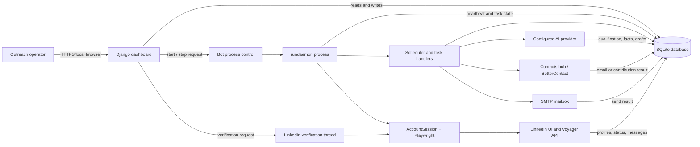
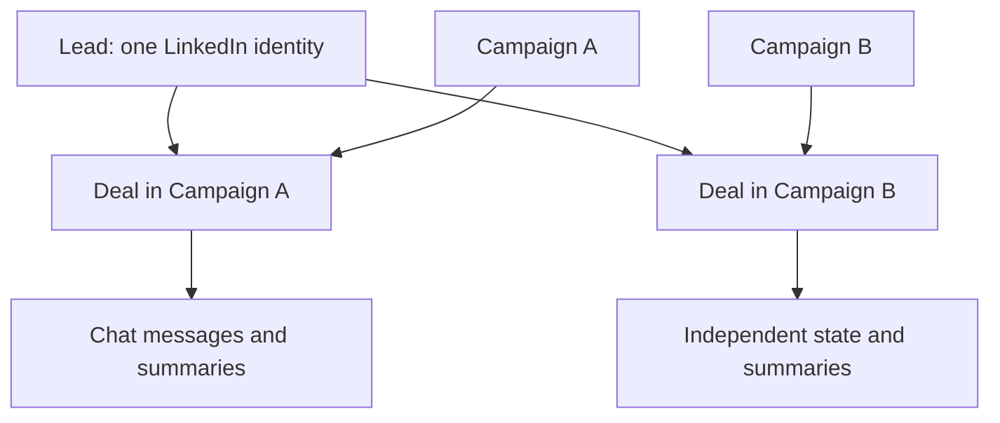

# System Diagram

> **Purpose:** Show the main runtime components and information flow.
> **Read this before:** Cross-module changes or integration work.
> **Source files:** `linkreach/urls.py`, `linkreach/core/daemon.py`, `linkreach/core/scheduler.py`, `linkreach/linkedin/browser/session.py`

The dashboard and daemon are separate processes in local development. They
coordinate through the database and log file; they do not share Python memory.
The verification thread is an exception: it lives inside the dashboard process.

