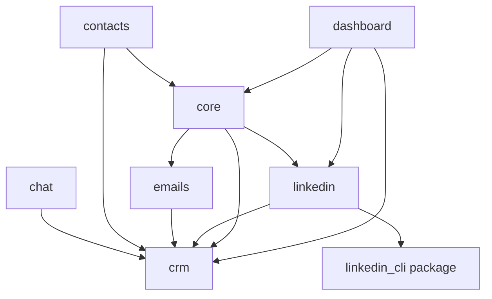

# Module Map

> **Purpose:** Assign one primary responsibility to every major module.
> **Read this before:** Adding a feature or deciding where code should live.
> **Source files:** `linkreach/settings.py:38`, `CLAUDE.md:34`, `ARCHITECTURE.md:101`

| Module | Responsibility | Must not own |
|---|---|---|
| `linkreach.core` | orchestration, config, Campaign, Task, BotProcess, scheduling, AI model construction | LinkedIn DOM mechanics |
| `linkreach.crm` | durable Lead and Deal data plus Deal state vocabulary | browser sessions or web views |
| `linkreach.linkedin` | sender account, LinkedIn pipeline, rate logs, channel task handlers, browser glue | global process management |
| `linkedin_cli` dependency | LinkedIn navigation, login, Voyager, connect/message/status verbs | campaign, Deal, or scheduler policy |
| `linkreach.emails` | mailbox setup, enrichment client, SMTP send, email task | LinkedIn connection flow |
| `linkreach.contacts` | central contact-store resolve/contribute client | local Lead lifecycle policy |
| `linkreach.chat` | persisted LinkedIn messages | conversation scraping policy |
| `linkreach.dashboard` | authenticated pages, forms, imports/exports, presentation services, bot/account controls | long-running automation work |

## Dependency direction

Avoid importing dashboard code into worker modules. Shared behavior belongs in a
service owned by the relevant domain, not in a view or template helper.

