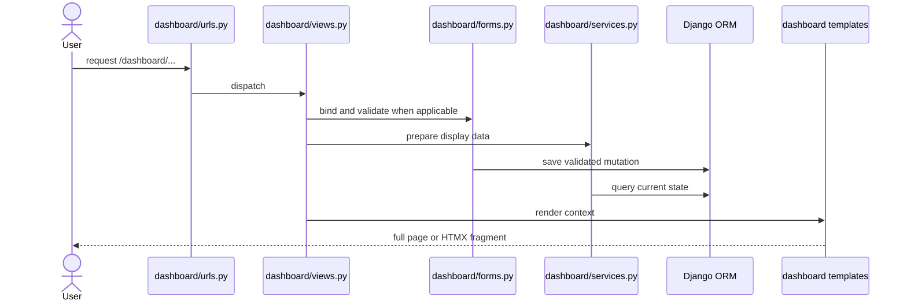

# Dashboard Architecture

> **Purpose:** Explain how dashboard URLs, views, forms, services, and templates cooperate.
> **Read this before:** Adding a page, action, form, import, export, or live dashboard component.
> **Source files:** `linkreach/dashboard/urls.py:7`, `linkreach/dashboard/views.py:38`, `linkreach/dashboard/services.py:32`, `linkreach/dashboard/templates/dashboard/base.html:200`

All dashboard routes live under `/dashboard/` and require Django authentication at
the view level. Views build breadcrumb and page context explicitly; there is no
dashboard context processor. `services.py` contains read-oriented presentation
queries and transformations, while `forms.py` validates account, campaign, and AI
settings.

Important exceptions:

- CSV parsing and import mutation currently live directly in `views.py:284-565`.
- bot actions call `core.bot_process` from `views.py:873-886`.
- LinkedIn verification launches a background thread through
  `linkedin/browser/verify.py`, never inline in the request.
- lead details use a custom `fetch()` drawer as well as a direct full-page route.

The dashboard is not a React application. It is server-rendered Django HTML with
HTMX navigation/polling and small vanilla JavaScript behaviors.

