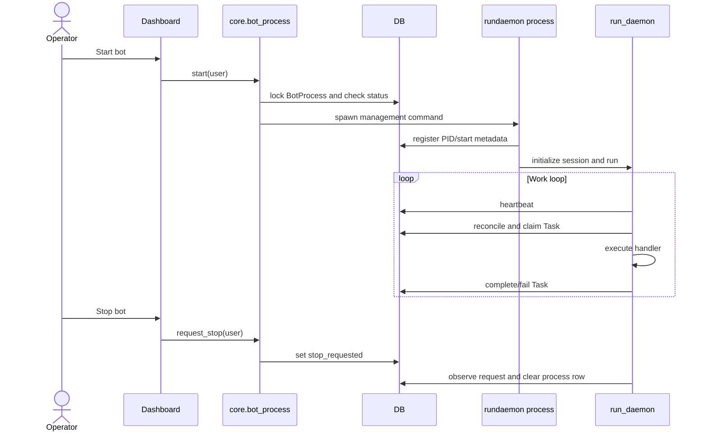

# Daemon And Bot Architecture

> **Purpose:** Describe the long-running worker and its control lifecycle.
> **Read this before:** Changing task execution, bot controls, monitoring, startup, sleep, or shutdown.
> **Source files:** `linkreach/core/management/commands/rundaemon.py:15`, `linkreach/core/daemon.py:320`, `linkreach/core/bot_process.py:56`

`manage.py rundaemon` is the automation process. Startup performs migrations,
onboarding/config checks, browser/session setup, and reconciliation before entering
the queue loop. The daemon writes process heartbeats and checks the singleton
`BotProcess.stop_requested` flag during its loop and heartbeat-aware sleeps.

`get_status()` combines OS PID liveness, heartbeat freshness, startup/stopping
grace periods, and managed-deployment configuration. A PID alone is not proof that
the correct bot is healthy; Windows PID reuse remains possible because `psutil`
creation-time verification is not implemented.

Only one bot is modeled. `BotProcess` is a singleton and `get_first_active_profile()`
selects one LinkedIn account. Multi-account execution requires architectural work,
not merely another profile form.

