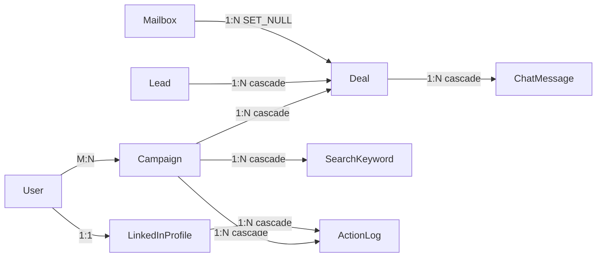

# Database Architecture

> **Purpose:** Explain persistence, ownership, constraints, and transaction expectations.
> **Read this before:** Schema changes, bulk updates, deletion, process coordination, or imports.
> **Source files:** `linkreach/settings.py:83`, `linkreach/core/models.py`, `linkreach/crm/models/`, `linkreach/*/migrations/`

The default database is SQLite at `data/db.sqlite3`. Django ORM models are split by
domain, but worker and dashboard processes share this single durable state store.

Key constraints:

- `SiteConfig` and `BotProcess` force `pk=1` in `save()`.
- Lead URL, public identifier, and non-null URN are unique.
- one Deal is allowed per `(lead, campaign)`.
- one LinkedInProfile is allowed per Django user.
- a ChatMessage URN is unique within its Deal.
- Campaign names and Mailbox usernames are unique.

Model changes require a Django migration and upgrade path. Direct queryset
`update()` does not call model `save()` or domain transition hooks. Use it only
when skipped effects are intentional and tested.

SQLite coordinates the dashboard and daemon, but it is not a general distributed
message broker. Long transactions or frequent writes can lock the database.

