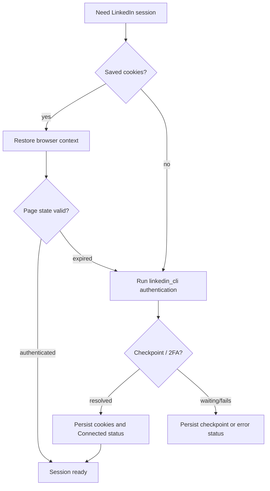

# Browser Automation

> **Purpose:** Explain the boundary between linkreach policy and LinkedIn mechanics.
> **Read this before:** Changing login, cookies, browser launch, verification, profile scraping, connections, or messaging.
> **Source files:** `linkreach/linkedin/browser/session.py:23`, `linkreach/linkedin/browser/launch.py:26`, `linkreach/linkedin/browser/registry.py:11`, `requirements/base.txt`

linkreach consumes the separately distributed `linkedin-agent-cli` package,
imported as `linkedin_cli`. That package owns LinkedIn page-state classification,
authentication flow, Voyager API access, and low-level connect/message/status
operations. This repository owns the launch/cookie glue and business policy.

`AccountSession` binds:

- one `LinkedInProfile` and its credentials/cookies;
- its related campaigns and current campaign context;
- Playwright objects;
- operator identity and active-hours timezone.

`start_browser_session()` launches or connects the browser, authenticates, persists
cookies, and writes a UI-safe connection status. Both the daemon and the manual
verification thread call this same function.

Do not duplicate login logic in dashboard code. Do not run Playwright synchronously
inside an HTTP request. Avoid concurrent manual verification and bot operation for
the same account; both can open browser sessions and write cookies.

