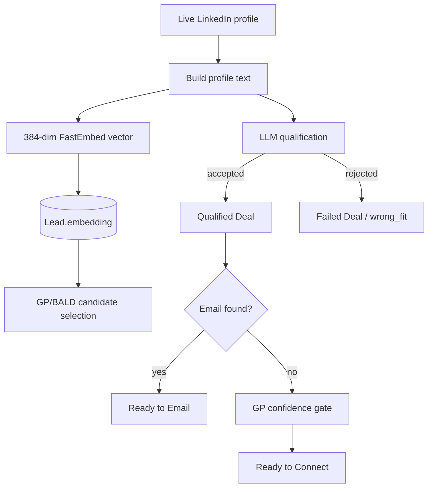

# AI And ML Pipeline

> **Purpose:** Describe where AI and statistical models influence outreach.
> **Read this before:** Changing prompts, providers, embeddings, qualification, summaries, ranking, or campaign models.
> **Source files:** `linkreach/core/llm.py:171`, `linkreach/linkedin/ml/qualifier.py:47`, `linkreach/linkedin/ml/embeddings.py:16`, `linkreach/core/db/summaries.py:95`

The GP does not make final qualification decisions. It selects or ranks candidates
and gates Qualified Deals into Ready to Connect. The LLM makes the fit decision.
Training labels come from campaign-specific Deals; the serialized campaign model is
stored in `Campaign.model_blob`.

Profile and chat summaries are JSON fact lists. Profile facts are materialized on
first follow-up use; chat facts reconcile only newly synchronized incoming messages.
The seller identity is injected to avoid misattributing the operator's name to the lead.

Changing the embedding model dimension invalidates assumptions in stored binary
vectors and campaign model blobs. Treat that as a data migration/rebuild, not a
configuration-only change.

