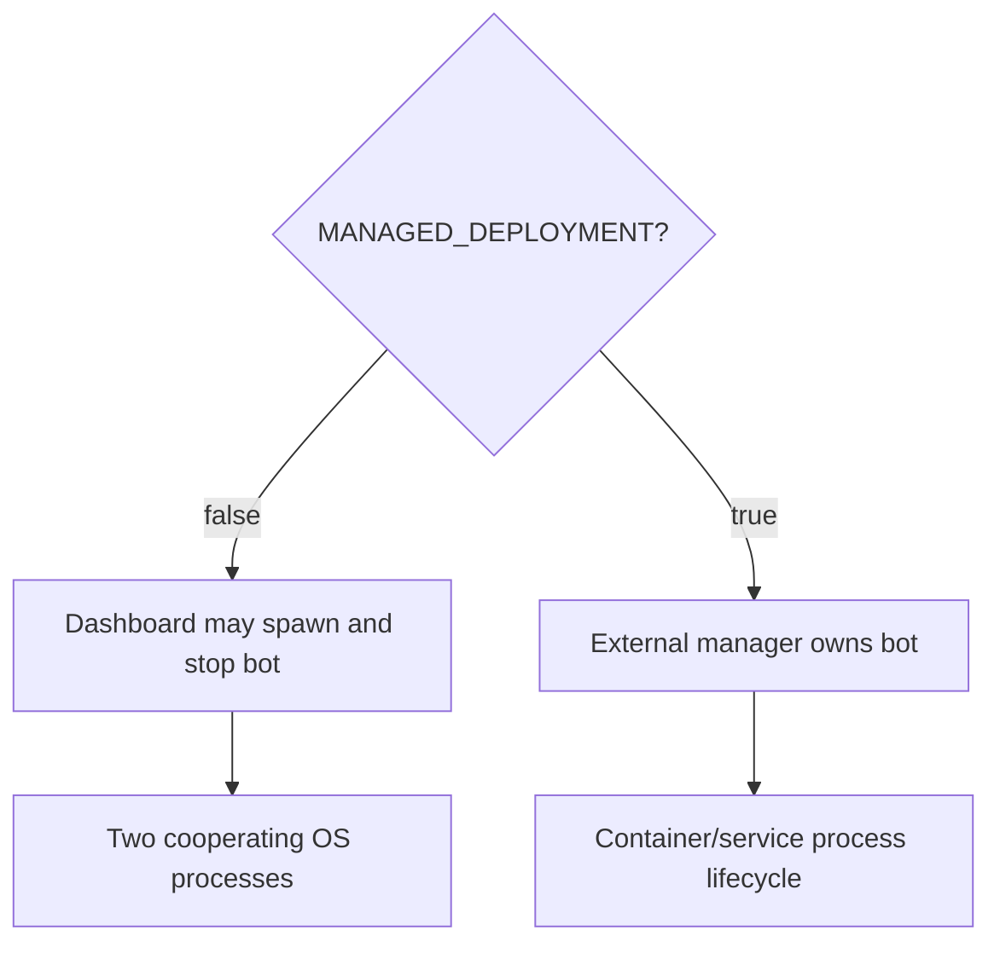

# Local Versus Managed Runtime

> **Purpose:** Explain how process ownership differs between local Windows and managed deployments.
> **Read this before:** Changing startup scripts, bot controls, Docker, browser paths, or deployment configuration.
> **Source files:** `Start-Dashboard.bat`, `Start-Bot.bat`, `local.yml`, `compose/linkedin/Dockerfile`, `linkreach/settings.py:30`, `linkreach/core/bot_process.py:64`

## Local Windows

The dashboard and bot are separate processes. The dashboard may spawn `rundaemon`
through `core.bot_process.start()`. It passes the project-local Playwright browser
path and starter user id through environment variables. The child is detached and
writes to the daemon log.

## Managed / Docker

The process manager owns the bot lifecycle. `linkreach_MANAGED=true` becomes
`settings.MANAGED_DEPLOYMENT`; dashboard bot controls are disabled to prevent a
second daemon from starting inside the same installation.

Do not detect Docker through filesystem heuristics. Keep the explicit environment
flag. Keep `PLAYWRIGHT_BROWSERS_PATH` consistent across dashboard verification and
daemon startup or the two paths may use different browser installations.

