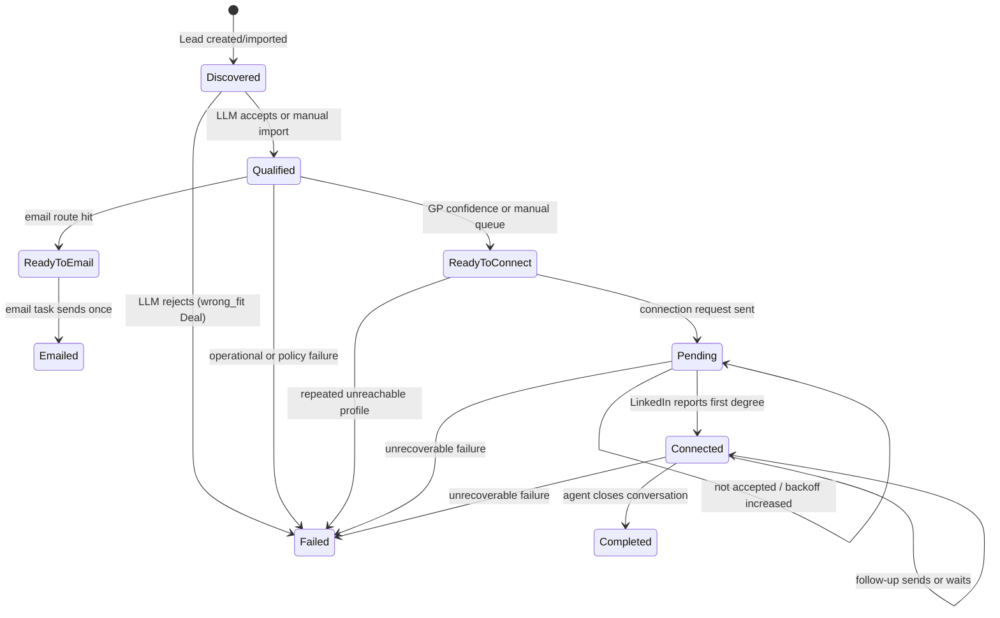

# Lead And Deal Lifecycle

> **Purpose:** Define the implemented outreach state machine and routing rules.
> **Read this before:** Changing Deal states, qualification, email routing, connection, follow-up, or outcomes.
> **Source files:** `linkreach/crm/models/deal.py:6`, `linkreach/core/db/deals.py:110`, `linkreach/linkedin/pipeline/qualify.py:44`

The email and LinkedIn paths are mutually expressed by state. A Deal with
`READY_TO_EMAIL` is not eligible for the connect pool. Sending sets `EMAILED`, which
is a Layer-1 resting state until a human supplies an outcome.

`Lead.disqualified=True` is permanent across campaigns. An LLM rejection is only a
Failed Deal in that campaign. Do not conflate them.

The canonical transition helper is `set_profile_state()`. It writes reason/outcome,
calls `on_deal_state_entered()`, and captures contact information on first Connected.
The dashboard's manual queue currently performs a direct Qualified → Ready to
Connect queryset update because no transition side effect is required for that edge.

