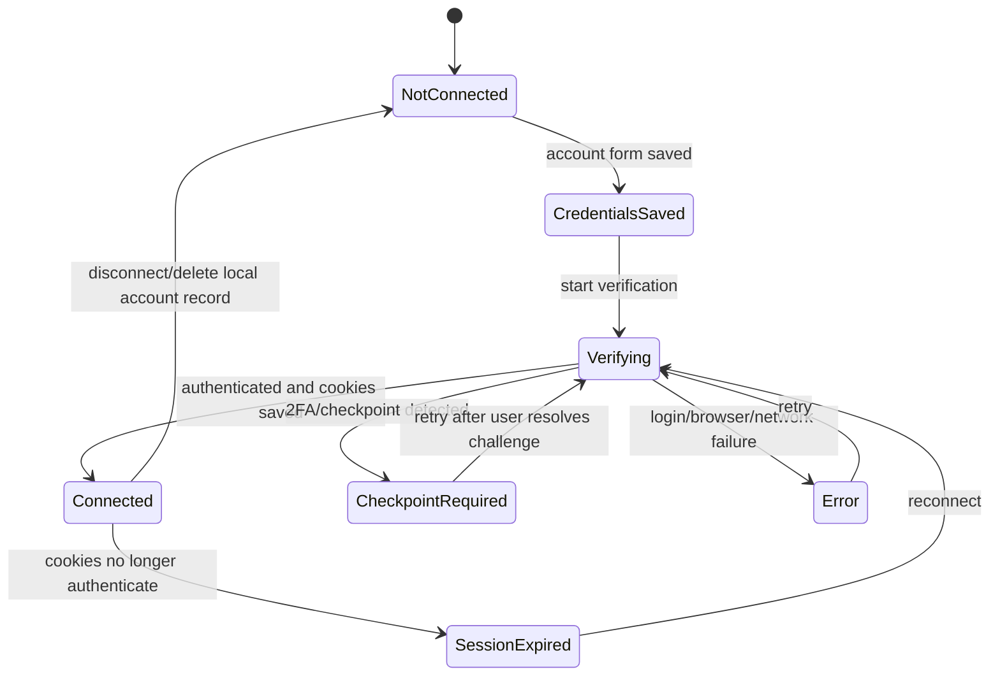

# LinkedIn Connection Status

> **Purpose:** Define the sender-account verification and recovery state machine.
> **Read this before:** Changing the LinkedIn Account page, login, verification, cookies, or status polling.
> **Source files:** `linkreach/linkedin/models.py:23`, `linkreach/linkedin/browser/launch.py`, `linkreach/linkedin/browser/verify.py:37`

Persisted statuses are `not_connected`, `credentials_saved`, `verifying`,
`checkpoint_required`, `connected`, `session_expired`, and `error`. Supporting
fields capture verification timestamps, a UI-safe error code/message, and the
checkpoint URL.

The in-memory `_running` set prevents double-click duplicate verification only
inside one dashboard process. It does not survive restart and does not coordinate
with the daemon process. The page must continue warning users not to verify while
the bot is running.

