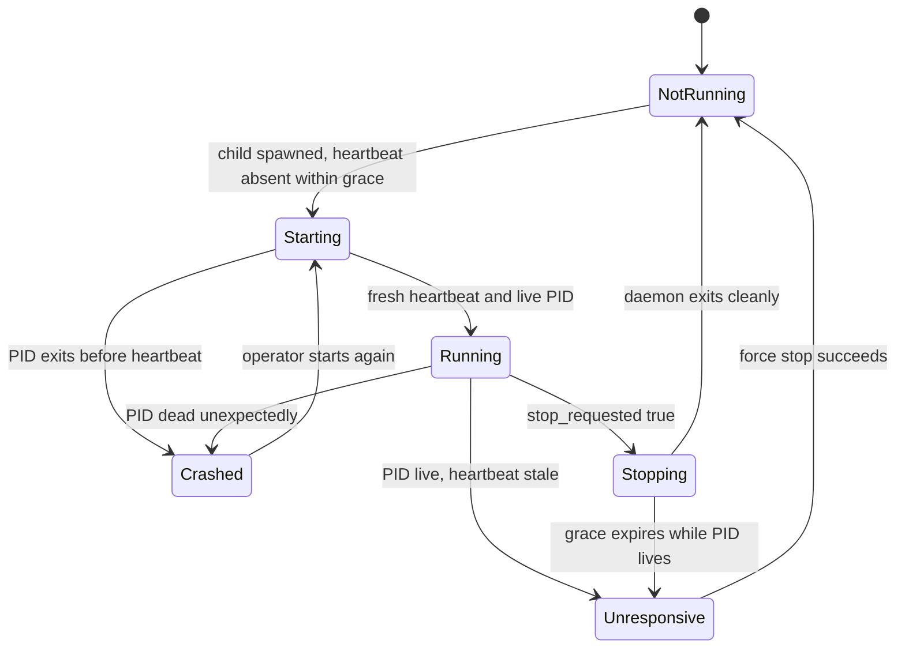

# Bot Process State

> **Purpose:** Define how dashboard monitoring derives bot process state.
> **Read this before:** Changing Start, Stop, Force stop, heartbeat, or Monitor status behavior.
> **Source files:** `linkreach/core/models.py:54`, `linkreach/core/bot_process.py:16`, `linkreach/core/daemon.py:130`

The stored row is not the displayed status by itself. `get_status()` combines:

- PID presence and OS liveness;
- heartbeat timestamp age (fresh for 45 seconds);
- startup grace (90 seconds);
- stopping grace (60 seconds);
- stop-request flag;
- managed-deployment controls.

The row records the current or last-known process, not a historical process log.
Do not use it to support multiple accounts without changing its singleton schema.

