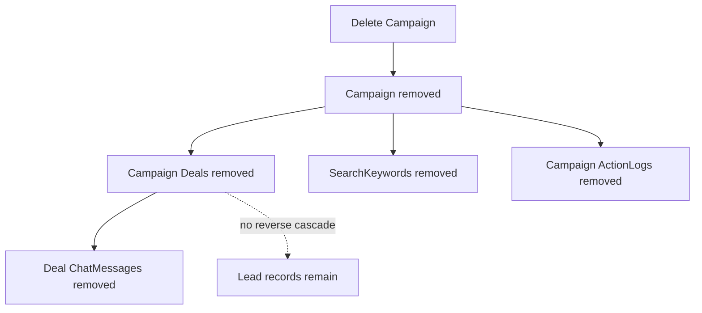

# Deletion, Cascades, And Retention

> **Purpose:** State exactly what deletion removes and what remains.
> **Read this before:** Adding delete actions, cleanup jobs, GDPR controls, or changing foreign keys.
> **Source files:** `linkreach/dashboard/views.py:225`, `linkreach/core/models.py:81`, `linkreach/crm/models/deal.py:63`, `linkreach/chat/models.py:21`

## Campaign deletion

The dashboard calls `campaign.delete()`. Django cascades to the Campaign's Deals,
SearchKeywords, and ActionLogs. Each deleted Deal cascades to its ChatMessages.
The underlying Lead is **not** deleted because the foreign key points from Deal to
Lead, and a Lead may be shared by other campaigns or remain available for later use.

## Other cascade behavior

- deleting a Lead cascades all of its Deals and those Deals' messages.
- deleting a Django user cascades its LinkedInProfile; Campaign membership is removed.
- deleting a LinkedInProfile cascades its ActionLogs.
- deleting a Mailbox sets `Deal.mailbox` to null but preserves sent-deal metadata.
- deleting the user who started a bot sets `BotProcess.started_by` to null.

## Retention gaps

There is no documented automatic orphan-Lead cleanup or end-user data-erasure flow.
`UNVERIFIED:` confirm legal retention requirements before adding cleanup. A cleanup
must distinguish orphan Leads from Leads still referenced by any Deal and must
consider embeddings, contact data, and central-service contributions.

