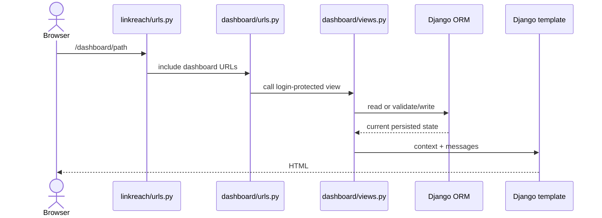

# Request Flow

> **Purpose:** Trace normal dashboard reads and mutations end to end.
> **Read this before:** Adding routes, forms, actions, fragments, or redirects.
> **Source files:** `linkreach/urls.py:8`, `linkreach/dashboard/urls.py:7`, `linkreach/dashboard/views.py`, `linkreach/dashboard/templates/dashboard/base.html:201`

HTMX-boosted navigation sends a request for the normal page, selects `#oo-app` from
the response, swaps the outer application shell, and updates browser history. This
means every boosted destination must still render a complete valid page for direct
navigation and no-JavaScript fallback.

Mutation views use POST checks and Django CSRF tokens in templates. Several routes
are not decorated with `require_POST`; a GET reaches the view but does not mutate and
usually redirects. Preserve POST-only UI behavior and prefer adding an explicit
method decorator when hardening an endpoint.

Lead detail requests are different: `ooOpenDeal()` uses `fetch()` with an
`HX-Request` header. The same view returns a drawer partial for that header and a
full page otherwise.

