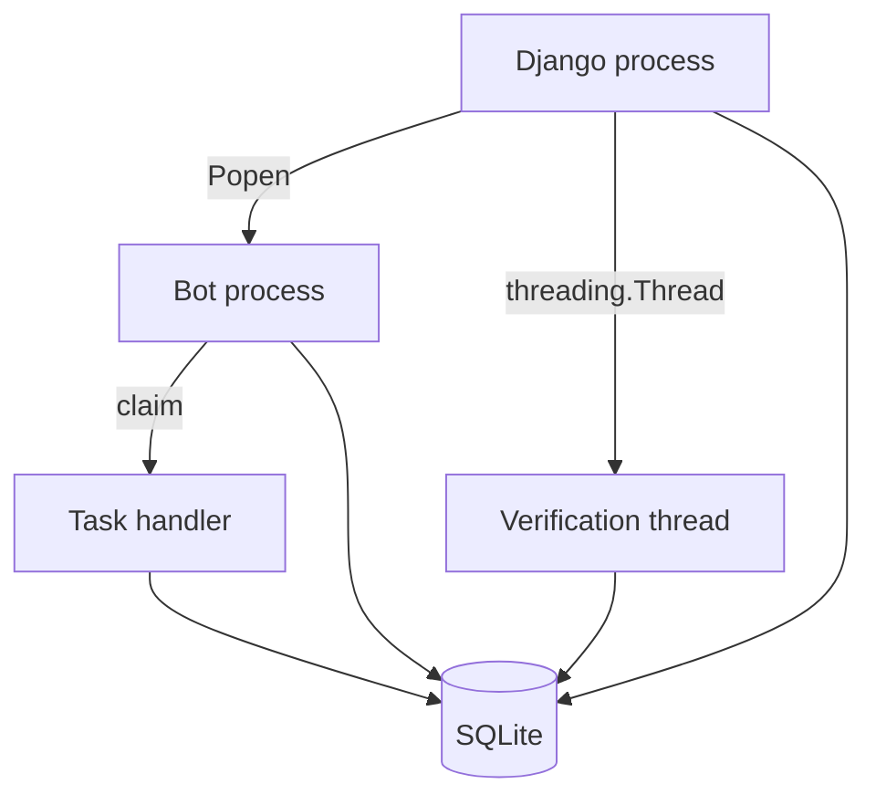

# Background Processes

> **Purpose:** Describe every execution context that can continue after an HTTP response.
> **Read this before:** Adding background work or assuming shared in-memory state.
> **Source files:** `linkreach/core/bot_process.py:129`, `linkreach/core/daemon.py:320`, `linkreach/linkedin/browser/verify.py:37`

| Context | Lifetime | Durable coordination | Owns browser? |
|---|---|---|---|
| Django dashboard server | until server exits/reloads | database, log reads | only during manual verification |
| `rundaemon` subprocess | until stopped/crashed | BotProcess, Task, domain rows, log | yes |
| verification daemon thread | until login attempt completes | LinkedInProfile status/cookies | yes |
| Task handler | one claimed Task inside daemon | Task and domain rows | uses daemon session |

The dashboard and daemon do not share Python globals. The verification thread does
share dashboard memory, which is why `_running` only prevents duplicate verification
inside that one process. A development server reload loses that guard.

Do not introduce another worker by starting a thread from a view unless the work is
strictly one-shot and its durable state/recovery story is documented. Persistent
work belongs in the Task/daemon system or an explicit future worker architecture.

