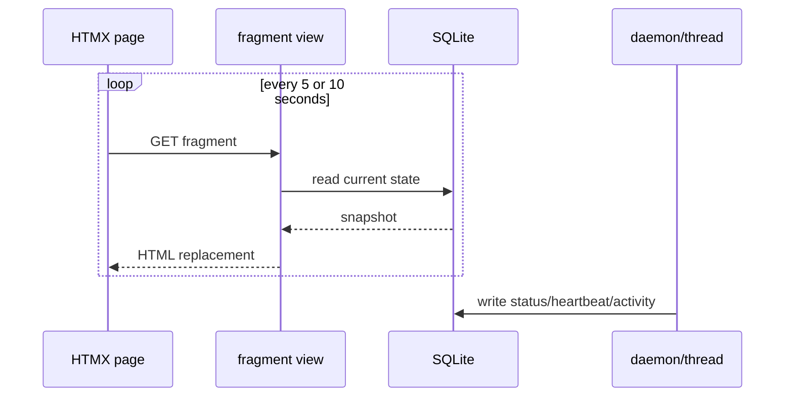

# Polling And Database As Message Bus

> **Purpose:** Explain how the dashboard observes and controls long-running work.
> **Read this before:** Changing live updates, heartbeat frequency, stop requests, status fragments, or task queues.
> **Source files:** `linkreach/dashboard/templates/dashboard/monitor.html:9`, `linkreach/dashboard/templates/dashboard/linkedin_account.html:6`, `linkreach/core/bot_process.py:228`

The project uses SQLite as a lightweight coordination plane:

- dashboard sets `BotProcess.stop_requested`; daemon polls it;
- daemon updates `last_heartbeat_at`; dashboard reads it;
- verification writes `LinkedInProfile.connection_status`; the account page polls it;
- scheduler creates Task rows; daemon polls, claims, and updates them;
- activity fragments query persisted ActionLogs, Tasks, Deals, and timestamps.

Polling is intentionally simple but has costs. Faster intervals add SQLite reads and
can overlap with writes. Fragment endpoints must stay read-only, small, and cheap.
They must not trigger browser work or expensive AI/model operations.

The database is not an event stream: activity views reconstruct a display from
current rows and logs. Absence of a rendered event does not prove an action never
happened.

