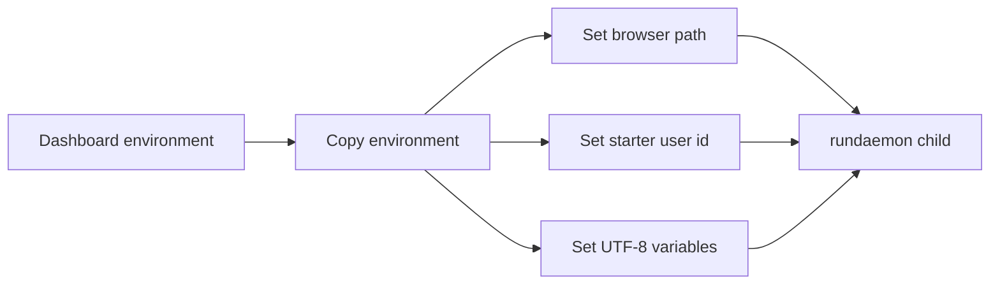

# Subprocesses And Environment Variables

> **Purpose:** Record what must be passed when the dashboard starts the bot.
> **Read this before:** Changing process launch, startup scripts, browser installation, user attribution, or managed deployment.
> **Source files:** `linkreach/core/bot_process.py:129`, `linkreach/core/management/commands/rundaemon.py:56`, `linkreach/settings.py:15`, `Start-Bot.bat`

`core.bot_process.start()` launches the current Python executable with
`manage.py rundaemon`. It sets the working directory to the project root and passes
a copied environment with these important additions:

| Variable | Meaning |
|---|---|
| `PLAYWRIGHT_BROWSERS_PATH` | project-local browser installation under `.browsers` |
| `linkreach_STARTED_BY_USER_ID` | dashboard user recorded on BotProcess startup |
| `PYTHONUTF8` | predictable UTF-8 mode for child process output |
| `PYTHONIOENCODING` | predictable stdout/stderr encoding |
| `linkreach_MANAGED` | read by Django settings to disable local process controls |
| `DJANGO_SETTINGS_MODULE` | established by Django/CLI bootstrap where required |

Never pass API keys or LinkedIn passwords through process command-line arguments;
they can be visible in process listings. The child reads persisted configuration
from the database. Keep child stdout/stderr detached from unread pipes to avoid a
deadlock when buffers fill.

