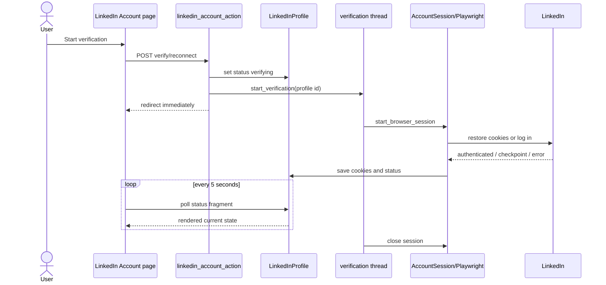

# LinkedIn Verification Thread

> **Purpose:** Document the manual LinkedIn verification sequence and its recovery limits.
> **Read this before:** Changing account connect/reconnect buttons, 2FA/checkpoints, or dashboard browser startup.
> **Source files:** `linkreach/dashboard/views.py:119`, `linkreach/linkedin/browser/verify.py:1`, `linkreach/linkedin/browser/launch.py`

The thread catches unexpected exceptions so the server does not leave a silent
traceback without cleanup, while `start_browser_session()` is expected to persist
user-safe statuses for known authentication/checkpoint outcomes.

Limitations:

- no durable job row records that verification is running;
- no cross-process lock with the daemon;
- dashboard restart kills the daemon thread and clears its guard;
- checkpoint timing depends on `linkedin_cli` configuration;
- only one browser should act on a sender account at a time.

